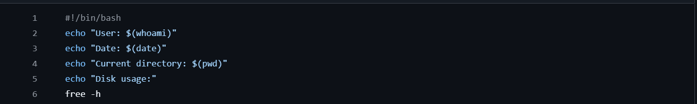

# **Dev-Ops Internship**

## **Week 1:**

### Interns must create a Linux practice workspace, write shell scripts for system information and backup simulation,

### inspect logs, use grep to search text, and practice file permissions. The practical work should train them to use terminal

### confidently before cloud and Docker work starts.

In this task, we created a Linux practice workshape for our devops-intern. We created a file system with devops-internship/ week1/ {script, logs, backup and notes}. Then we added some intro text into the notes by creating a new .txt file within it. Similarly we also created a .sh file in script that displayed user info, date, current directory and data usage. The screenshot for this scripting is provided below:

We then used chmod +x to execute the file ( Although bash could directly be used, we wanted to practice file permissions), and used tee command to store the data directly into logs. Moving on, we were able to use the grep command to search for specific data within the logs such as 'user' or 'data usage'.
Additionally, we also created a new file that allowed us to directly create a backup of the script folder and the notes folder. We did this by creating an executable file that recursively copied the contents of these folders into two separate folders within backup. We tested it and the backup sh code ran perfectly and did not mess with the log since we had not intended for there to be a tee command. The screenshot is provided below:

## 

## Week 2:

