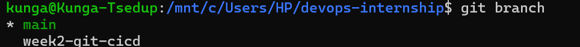
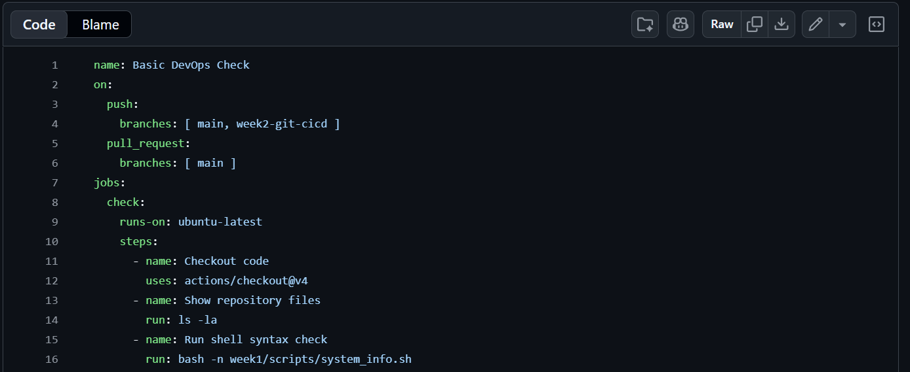
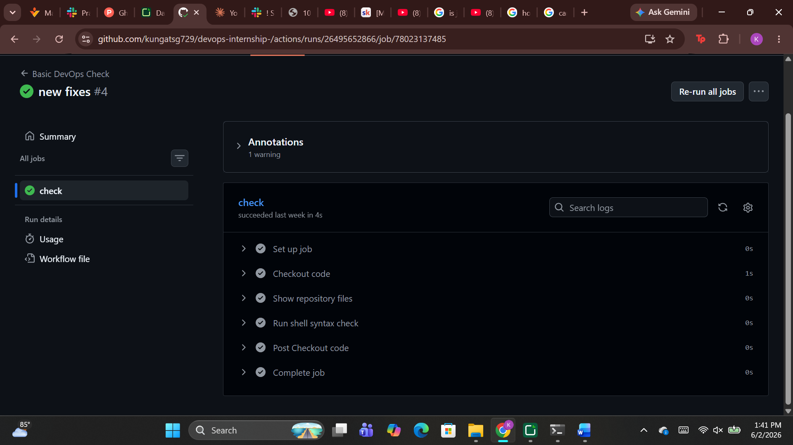

## Week 2 — Git & GitHub Actions CI/CD

> **Task:** Push Week 1 Linux scripts to GitHub, create a new branch, update README.md, open a pull request, and set up a simple GitHub Actions workflow that validates the repository by running shell commands.

### Pushing Week 1 Scripts to GitHub

In this week's task, we firstly learned how to use git. We learned all the important commands:

| Command | Purpose |
|---|---|
| `git init` | Start a git repository |
| `git add` | Stage changes |
| `git status` | View staged changes |
| `git commit` | Commit staged changes |
| `git log` | View commit history |

Additionally, we learned how to create and connect to a repository in GitHub to take our work from local to remote. We used the command `git remote add name <link>`. We used SSH keys instead of personal tokens to prevent the hassle of having to login again and again.

After linking our week1 devops-internship directory to GitHub, we pushed all of the code using `git push -u origin main`. In practice, it is always advised to pull before pushing to prevent unwanted errors but we ignored this since our repository was empty. Given below is the screenshot of our pushed repository:

*Figure 3 — repository pushed into GitHub*

In Figure 3, we can also see a `.gitignore` file stored. A `.gitignore` file is an invisible file that contains files that you do NOT want to push to GitHub. This includes sensitive files like SSH keys, passwords, secrets, etc.

### Creating a New Branch

For the next task we created a branch in our repository. We were originally in the `main` branch but we created a separate branch called `week2-git-cicd`. Branches are an important part of git since they help us to debug, test out new features, etc in a safe environment without harming the original file.

We created a branch using `git branch week2-git-cicd` and used `git checkout week2-git-cicd` to move into it. We can see the branches using the `git branch` command like shown below:

*Figure 4 — git branches*

After creating the branch and making some changes, we checked the main branch and confirmed the files there stayed exactly the same. Then we committed the changes and pushed to GitHub, created a pull request, and merged the branches into main using `git merge`.

### CI/CD with GitHub Actions

CI/CD is a core aspect of DevOps and cloud engineering. A CI/CD pipeline is a repeatable sequence of steps that organises tasks, info and decisions to accomplish a specific goal.

To create one, we first created a CI/CD file under `.github/workflows`. This is vital while creating any CI/CD file. We wrote it using YAML, a data serialisation language. The file we created is shown below:

*Figure 5 — CI pipeline*

This file created a condition testing code validity that ran when one of our branches pushed or our main branch received a pull request. We tested this by pushing a branch with intentional errors:

*Figure 6 — error in CI*

*Figure 7 — error details*

GitHub Actions logged the user who made the push and rejected it due to a YAML syntax error on line 2. We also received an email regarding the rejection. This showcases the obvious benefits of a CI pipeline — clear accountability, error description and error notification making the developer's job easier.

We fixed the error and pushed again:

*Figure 8 — fixed push*

*Figure 9 — fixed push info*

> **Conclusion:** We learned how to confidently operate using git and GitHub while also learning how to build a basic YAML file and diving into the fundamentals of CI/CD. We will use this knowledge throughout our internship and future endeavors.
