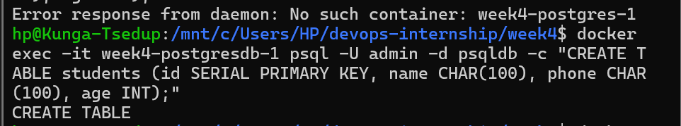
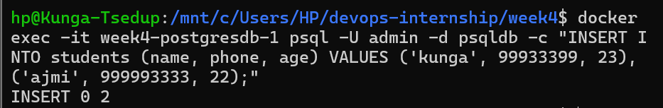
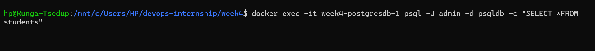
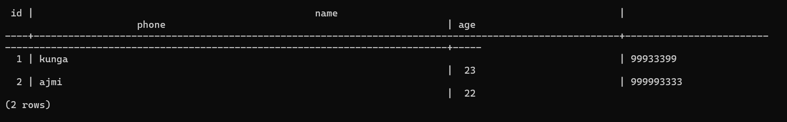
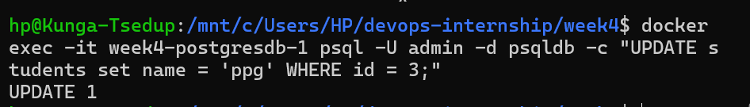
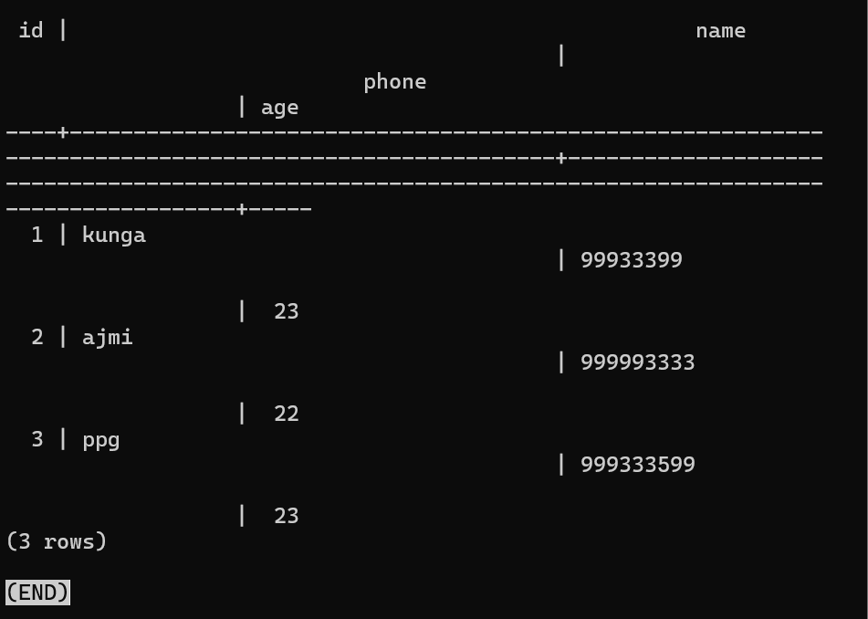
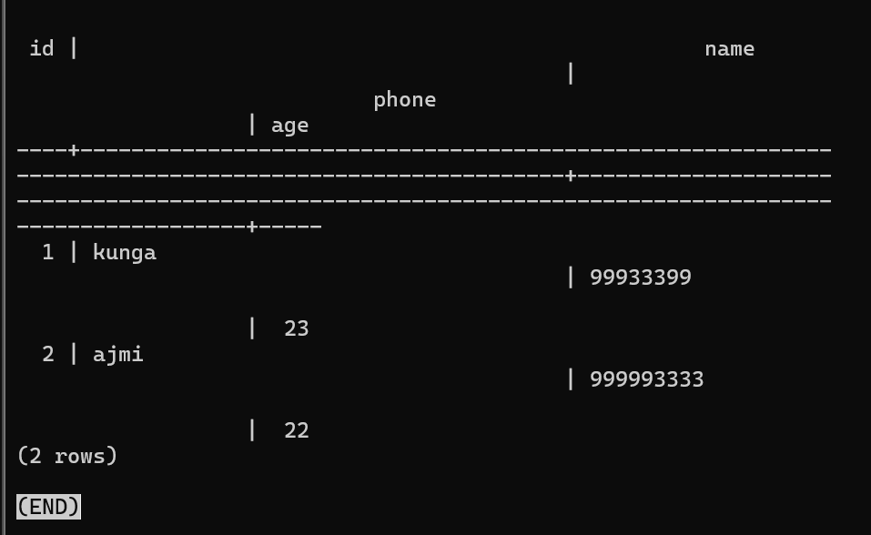
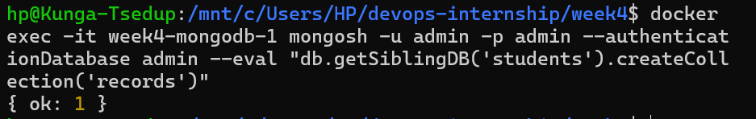
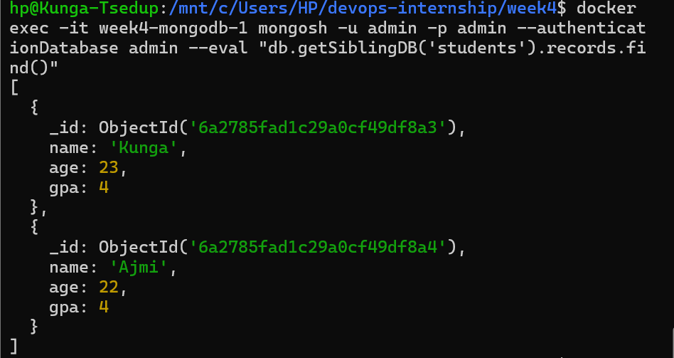
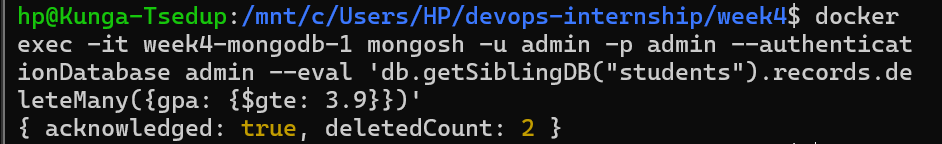

## Week 4 — PostgreSQL & MongoDB

> **Task:** Run PostgreSQL and MongoDB in containers, perform basic CRUD operations, create persistent volumes, inspect logs, and write connection details as environment variables.

In this week, we combined what we had learned in earlier weeks to run a persistent volume database fully inside a container. We did this by creating a Docker Compose file as shown below:

*Figure 22 — database docker-compose.yml*

We selected the appropriate images, set the environment variables, exposed their respective ports and mapped the volume to physical local storage for persistence. Mapping the volume is important especially in containerised databases since killing the container kills the data permanently without it.

We ran the compose file using the `-f` flag since we already had a docker-compose file and didn't want them to clash:

*Figure 23 — running the database compose file*

### PostgreSQL CRUD Operations

**Create (Table)**

*Figure 24 — creating a table*

**Insert**

*Figure 25 — inserting data*

*Figure 26 — selecting data*

*Figure 27 — database table view*

**Update**

*Figure 28 — update command*

*Figure 29 — updated data*

**Delete**

*Figure 30 — delete command*

*Figure 31 — data after deletion*

### MongoDB CRUD Operations

**Create**

*Figure 32 — creating a database*

*Figure 33 — inserting a document*

*Figure 34 — inserted data*

**Update**

*Figure 35 — update command*

*Figure 36 — updated data*

**Delete**

*Figure 37 — delete command*

*Figure 38 — data after deletion*

After checking all these operations, we further checked our logs to exercise our understanding. We saw that our records were stored along the many lines as shown below:

*Figure 39 — container logs*

### SQL vs NoSQL

| | PostgreSQL (SQL) | MongoDB (NoSQL) |
|---|---|---|
| Structure | Tables with rows and columns | Collections with JSON documents |
| Schema | Strict — defined before inserting | Flexible — no predefined structure |
| Best for | Predictable, relational data | Variable or rapidly changing data |
| Query style | SQL syntax | Document query syntax |

### Why Volumes Are Needed

When we first ran the database container without a volume, every time we stopped and removed the container all data was gone. Containers don't store data permanently by default — everything inside them is temporary.

Volumes fix this by storing the actual database files outside the container on the host machine. So even if the container crashes or gets deleted, the data is still there. When a new container starts with the same volume attached, it picks up right where it left off.

> **Conclusion:** This week we got PostgreSQL and MongoDB running together using Docker Compose. The biggest thing that clicked was volumes — we actually lost data after stopping a container which made it immediately obvious why volumes exist. Comparing SQL and NoSQL hands-on was more useful than just reading about it.
