#  DevOps Internship

> An 8-week hands-on internship covering Linux, Git, Docker, Databases, AWS, Kubernetes, Monitoring, and Secrets Management.

---

## Table of Contents

- [Week 1 — Linux Workspace](#week-1--linux-workspace)
- [Week 2 — Git & GitHub Actions CI/CD](#week-2--git--github-actions-cicd)
- [Week 3 — Docker & Containerization](#week-3--docker--containerization)
- [Week 4 — PostgreSQL & MongoDB](#week-4--postgresql--mongodb)
- [Week 5 — AWS EC2 & S3](#week-5--aws-ec2--s3)
- [Week 6 — Kubernetes with Minikube](#week-6--kubernetes-with-minikube)
- [Week 7 — Prometheus, Grafana & Vault](#week-7--prometheus-grafana--vault)
- [Week 8 — Final Integration](#week-8--final-integration)

---

## Week 1 — Linux Workspace

> **Task:** Create a Linux practice workspace, write shell scripts for system information and backup simulation, inspect logs, use grep to search text, and practice file permissions.

In this task, we created a Linux practice workspace for our devops-internship. We created a file system with `devops-internship/week1/{scripts, logs, backup, notes}`. Then we added some intro text into the notes by creating a new `.txt` file within it. Similarly we also created a `.sh` file in scripts that displayed user info, date, current directory and data usage. The screenshot for this scripting is provided below:


*Figure 1 — system_info.sh script*

We then used `chmod +x` to execute the file (although bash could directly be used, we wanted to practice file permissions), and used the `tee` command to store the data directly into logs. Moving on, we were able to use the `grep` command to search for specific data within the logs such as `user` or `data usage`.

Additionally, we also created a new file that allowed us to directly create a backup of the scripts folder and the notes folder. We did this by creating an executable file that recursively copied the contents of these folders into two separate folders within backup. We tested it and the backup script ran perfectly and did not mess with the log since we had not intended for there to be a `tee` command. The screenshot is provided below:

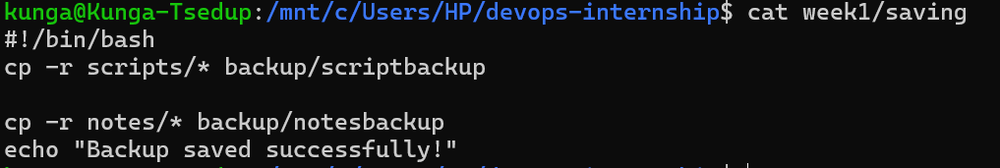
*Figure 2 — script for saving*

---

## Week 2 — Git & GitHub Actions CI/CD

> **Task:** Push Week 1 Linux scripts to GitHub, create a new branch, update README.md, open a pull request, and set up a simple GitHub Actions workflow that validates the repository by running shell commands.

### Pushing Week 1 Scripts to GitHub

In this week's task, we firstly learned how to use git. We learned all the important commands:

| Command | Purpose |
|---|---|
| `git init` | Start a git repository |
| `git add` | Stage changes |
| `git status` | View staged changes |
| `git commit` | Commit staged changes |
| `git log` | View commit history |

Additionally, we learned how to create and connect to a repository in GitHub to take our work from local to remote. We used the command `git remote add name <link>`. We used SSH keys instead of personal tokens to prevent the hassle of having to login again and again.

After linking our week1 devops-internship directory to GitHub, we pushed all of the code using `git push -u origin main`. In practice, it is always advised to pull before pushing to prevent unwanted errors but we ignored this since our repository was empty. Given below is the screenshot of our pushed repository:


*Figure 3 — repository pushed into GitHub*

In Figure 3, we can also see a `.gitignore` file stored. A `.gitignore` file is an invisible file that contains files that you do NOT want to push to GitHub. This includes sensitive files like SSH keys, passwords, secrets, etc.

### Creating a New Branch

For the next task we created a branch in our repository. We were originally in the `main` branch but we created a separate branch called `week2-git-cicd`. Branches are an important part of git since they help us to debug, test out new features, etc in a safe environment without harming the original file.

We created a branch using `git branch week2-git-cicd` and used `git checkout week2-git-cicd` to move into it. We can see the branches using the `git branch` command like shown below:


*Figure 4 — git branches*

After creating the branch and making some changes, we checked the main branch and confirmed the files there stayed exactly the same. Then we committed the changes and pushed to GitHub, created a pull request, and merged the branches into main using `git merge`.

### CI/CD with GitHub Actions

CI/CD is a core aspect of DevOps and cloud engineering. A CI/CD pipeline is a repeatable sequence of steps that organises tasks, info and decisions to accomplish a specific goal.

To create one, we first created a CI/CD file under `.github/workflows`. This is vital while creating any CI/CD file. We wrote it using YAML, a data serialisation language. The file we created is shown below:


*Figure 5 — CI pipeline*

This file created a condition testing code validity that ran when one of our branches pushed or our main branch received a pull request. We tested this by pushing a branch with intentional errors:


*Figure 6 — error in CI*


*Figure 7 — error details*

GitHub Actions logged the user who made the push and rejected it due to a YAML syntax error on line 2. We also received an email regarding the rejection. This showcases the obvious benefits of a CI pipeline — clear accountability, error description and error notification making the developer's job easier.

We fixed the error and pushed again:


*Figure 8 — fixed push*


*Figure 9 — fixed push info*

> **Conclusion:** We learned how to confidently operate using git and GitHub while also learning how to build a basic YAML file and diving into the fundamentals of CI/CD. We will use this knowledge throughout our internship and future endeavors.

---

## Week 3 — Docker & Containerization

> **Task:** Create a simple containerized application, build an image, run it as a container, check logs, stop/remove containers, and use Docker Compose to manage services together.

In this week, we learned how to create a simple containerized application using Docker and how to run it along with container creation, writing Dockerfiles and Docker Compose files.

The first thing we did was create a simple Python Flask application to run on localhost:

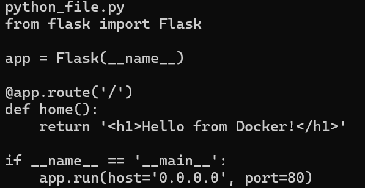
*Figure 10 — Python Flask application*

We then created a Dockerfile to containerize and run the application. We installed `python3` and `pip` for Flask within the file and created a command to be executed during container creation. We also copied our Python file into `/app`.

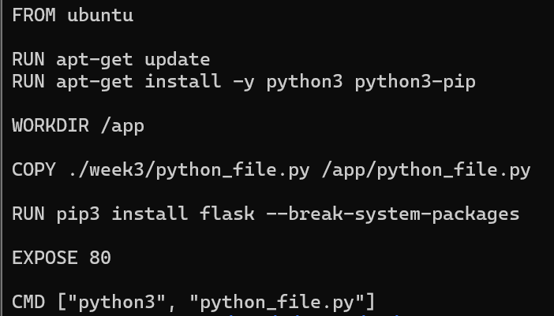
*Figure 11 — Dockerfile*

We then built the image and ran the container:

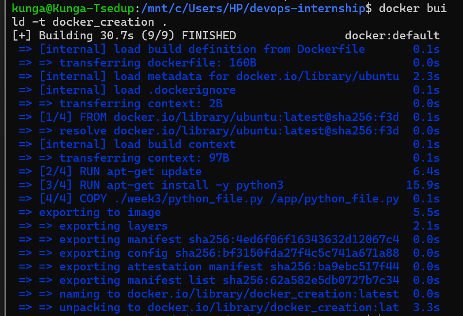
*Figure 12 — building the image*

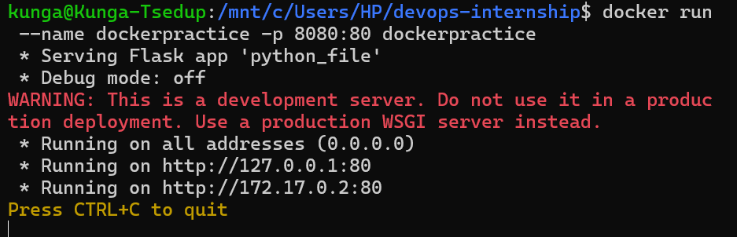
*Figure 13 — running the container*

We checked running containers using `docker ps`, viewed logs using `docker logs`, and stopped and removed the container using `docker stop` and `docker rm` respectively:

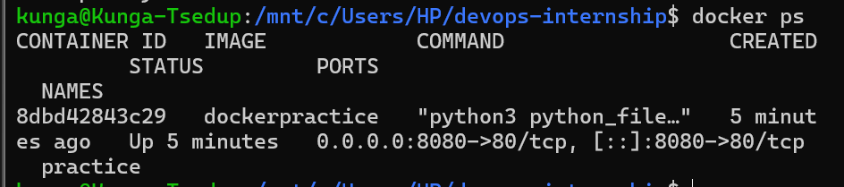
*Figure 14 — container status*


*Figure 15 — container logs*

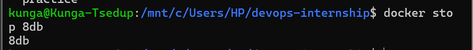
*Figure 16 — stopping the container*


*Figure 17 — removing the container*

### Docker Compose

Moving on, we created a `docker-compose.yml` file using the same Dockerfile for simplicity:

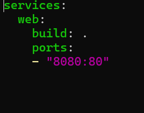
*Figure 18 — docker-compose.yml*

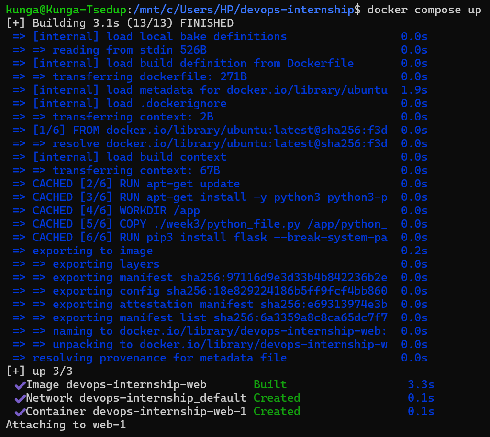
*Figure 19 — docker compose up*


*Figure 20 — compose container status*

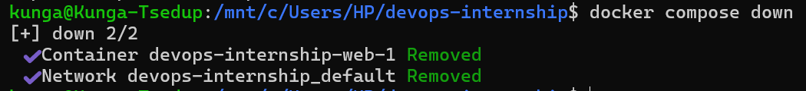
*Figure 21 — docker compose down*

> **Conclusion:** In this week, we thoroughly learned how to use Docker, its purposes, importance, the syntax of Dockerfiles and Compose files, the concept of volumes, port-mapping and more. We will be using the knowledge from this week throughout the coming weeks.

---

## Week 4 — PostgreSQL & MongoDB

> **Task:** Run PostgreSQL and MongoDB in containers, perform basic CRUD operations, create persistent volumes, inspect logs, and write connection details as environment variables.

In this week, we combined what we had learned in earlier weeks to run a persistent volume database fully inside a container. We did this by creating a Docker Compose file as shown below:


*Figure 22 — database docker-compose.yml*

We selected the appropriate images, set the environment variables, exposed their respective ports and mapped the volume to physical local storage for persistence. Mapping the volume is important especially in containerised databases since killing the container kills the data permanently without it.

We ran the compose file using the `-f` flag since we already had a docker-compose file and didn't want them to clash:


*Figure 23 — running the database compose file*

### PostgreSQL CRUD Operations

**Create (Table)**


*Figure 24 — creating a table*

**Insert**


*Figure 25 — inserting data*


*Figure 26 — selecting data*


*Figure 27 — database table view*

**Update**


*Figure 28 — update command*


*Figure 29 — updated data*

**Delete**


*Figure 30 — delete command*


*Figure 31 — data after deletion*

### MongoDB CRUD Operations

**Create**


*Figure 32 — creating a database*


*Figure 33 — inserting a document*


*Figure 34 — inserted data*

**Update**


*Figure 35 — update command*


*Figure 36 — updated data*

**Delete**


*Figure 37 — delete command*


*Figure 38 — data after deletion*

After checking all these operations, we further checked our logs to exercise our understanding. We saw that our records were stored along the many lines as shown below:


*Figure 39 — container logs*

### SQL vs NoSQL

| | PostgreSQL (SQL) | MongoDB (NoSQL) |
|---|---|---|
| Structure | Tables with rows and columns | Collections with JSON documents |
| Schema | Strict — defined before inserting | Flexible — no predefined structure |
| Best for | Predictable, relational data | Variable or rapidly changing data |
| Query style | SQL syntax | Document query syntax |

### Why Volumes Are Needed

When we first ran the database container without a volume, every time we stopped and removed the container all data was gone. Containers don't store data permanently by default — everything inside them is temporary.

Volumes fix this by storing the actual database files outside the container on the host machine. So even if the container crashes or gets deleted, the data is still there. When a new container starts with the same volume attached, it picks up right where it left off.

> **Conclusion:** This week we got PostgreSQL and MongoDB running together using Docker Compose. The biggest thing that clicked was volumes — we actually lost data after stopping a container which made it immediately obvious why volumes exist. Comparing SQL and NoSQL hands-on was more useful than just reading about it.

---

## Week 5 — AWS EC2 & S3

> **Task:** Deploy a Dockerized app to EC2, connect through SSH, install Docker, run the container, expose the correct port, and upload a sample file to S3.

### What is EC2 and S3?

**Amazon EC2 (Elastic Compute Cloud)** is essentially a rentable computer in the cloud. Instead of buying a physical server, we spin one up on AWS in minutes, choose the operating system, size, and region, and pay only for what we use. When we don't need it we stop it and stop paying.

**Amazon S3 (Simple Storage Service)** is cloud storage for files — not a computer you log into, just a place to put files. Images, backups, logs, videos, anything. Think of it like Google Drive but for applications rather than people.

Together they cover two fundamental cloud needs — **compute** (EC2 does the running and processing) and **storage** (S3 holds the data).

### EC2 Deployment

We logged into our AWS account, went to EC2, and created an instance — specifying the OS, hardware, generating a key pair and setting up security configurations:

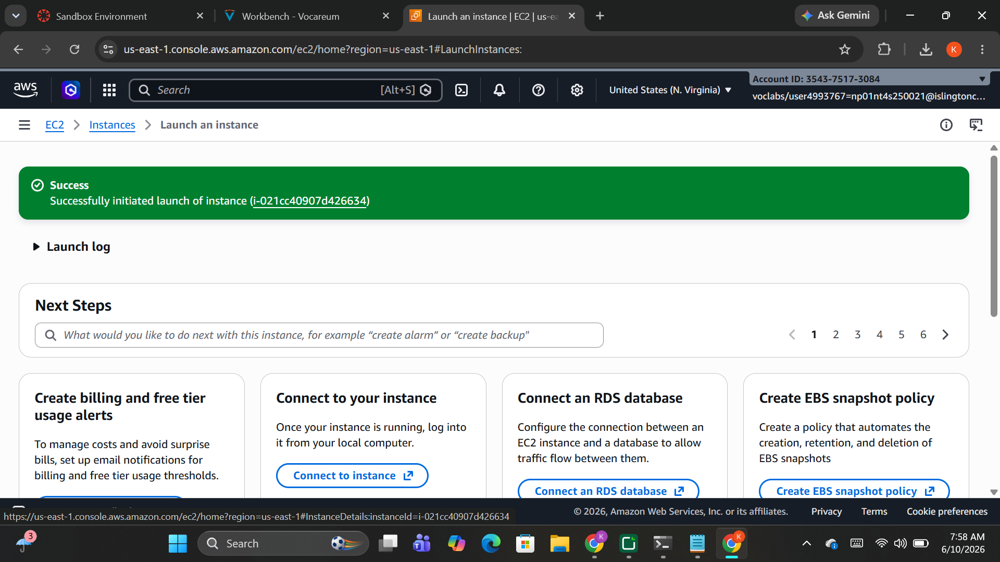
*Figure 40 — EC2 instance launched*

We then went to our key-pair location and opened a Git Bash terminal. We changed the permission for the key to `400`:

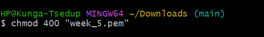
*Figure 41 — setting key permissions*

We then SSH'd into the EC2 instance:

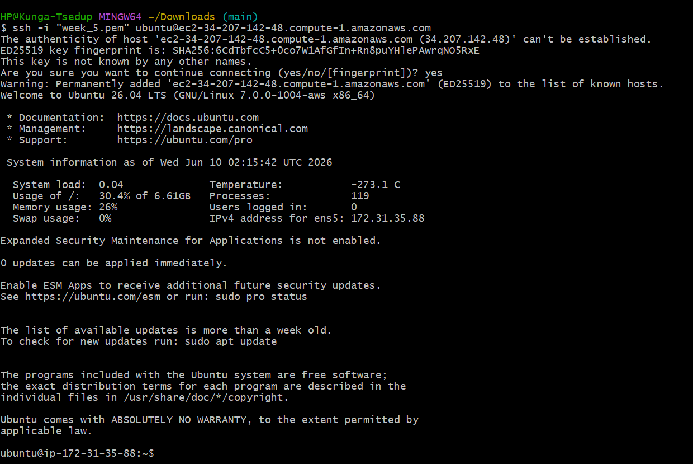
*Figure 42 — connecting to EC2*

The newly created EC2 machine does not come with pre-installed tools so we installed Docker, Git, and added an SSH key to GitHub:

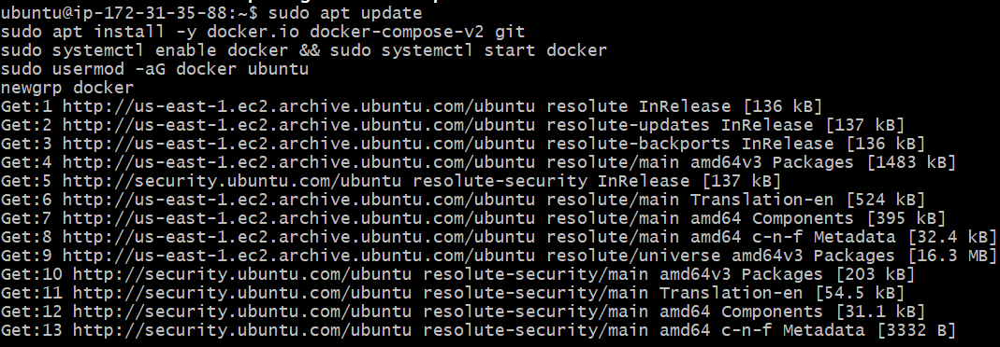
*Figure 43 — installing Git and Docker*

We cloned the repository into the EC2 instance:

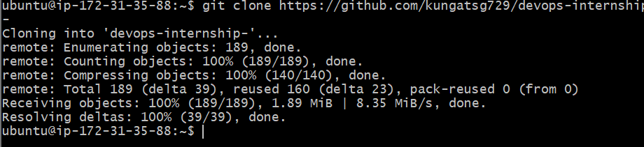
*Figure 44 — cloning the repository*

We ran the compose file to start the application:

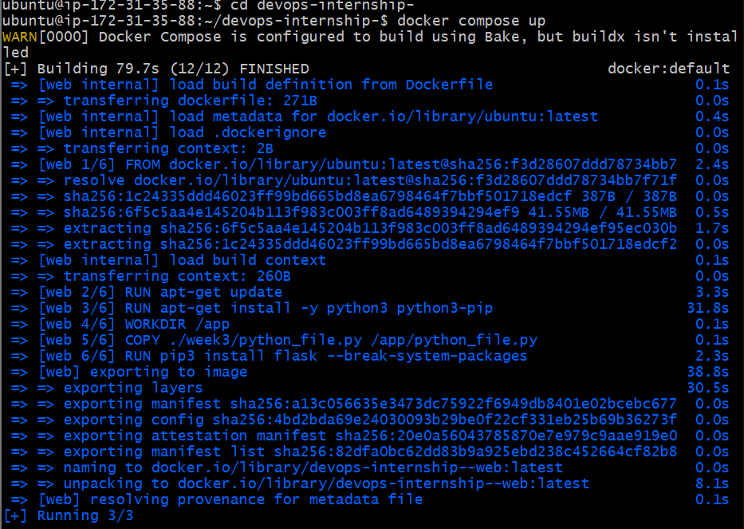
*Figure 45 — running docker compose*

We confirmed the container was up using `docker ps`:

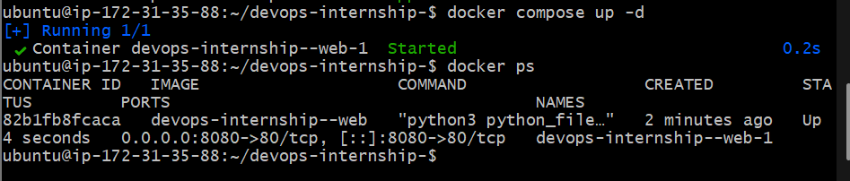
*Figure 46 — container running*

We used `curl` inside EC2 to confirm the site was reachable from the server itself:

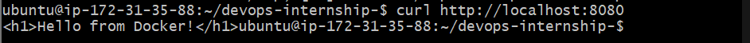
*Figure 47 — terminal curl check*

We found out that Amazon public IPs do NOT work on `https` and MUST use `http`. After switching, the app loaded successfully:

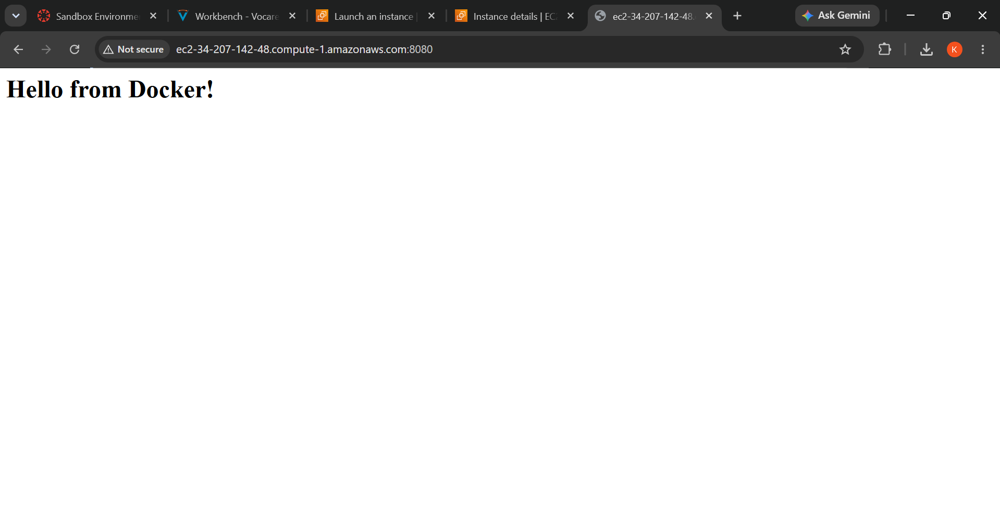
*Figure 48 — app visible in browser*

### S3 Storage

We configured AWS CLI on the EC2 instance using `aws configure`, specifying our keys, region and output format:

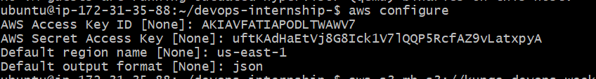
*Figure 49 — aws configure*

We then created an S3 bucket:

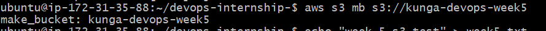
*Figure 50 — creating the S3 bucket*

We created a file and copied it into S3:

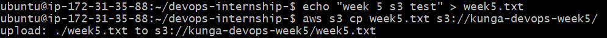
*Figure 51 — creating and uploading a file*

We confirmed the upload using `aws s3 ls`:

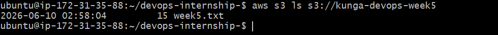
*Figure 52 — confirming upload via CLI*

We verified the bucket in the AWS dashboard:

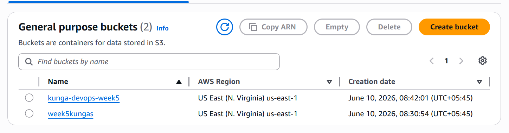
*Figure 53 — bucket in AWS dashboard*

We confirmed the file was inside the bucket:

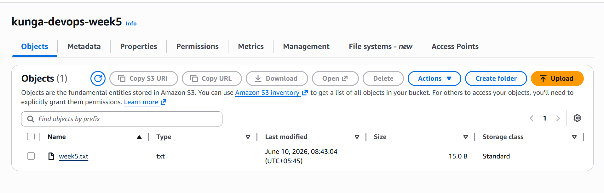
*Figure 54 — file inside the bucket*

For further practice, we moved a folder into S3 recursively using the `mv` command:

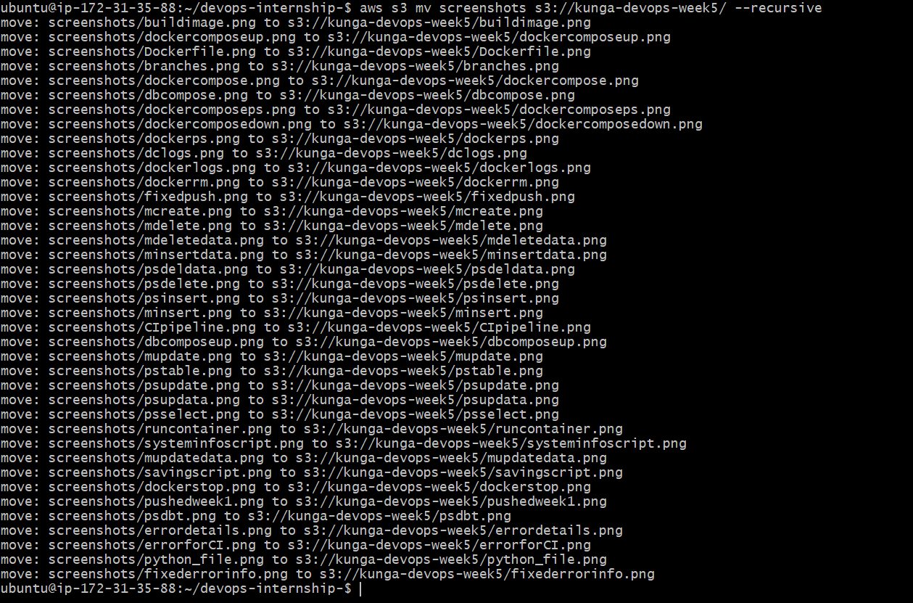
*Figure 55 — recursive move command*

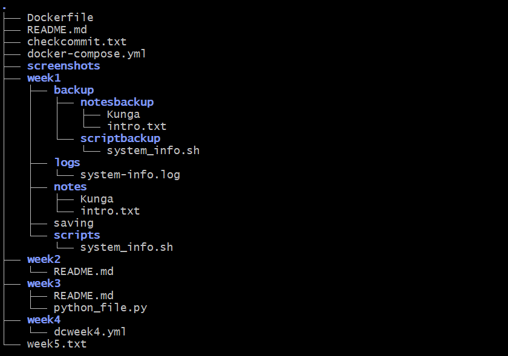
*Figure 56 — confirming the move*

> **Conclusion:** This week gave us our first real taste of cloud deployment. Moving from a local machine to an actual server on AWS and seeing our app live on a public IP was a significant step up from previous weeks. S3 also showed us how storage and compute are handled separately in the cloud — a fundamental concept in modern infrastructure.

---

## Week 6 — Kubernetes with Minikube

> **Task:** Deploy a Docker app to local Kubernetes, create YAML manifests, apply them, inspect pods, check logs, expose the service, scale replicas, delete pods, and observe Kubernetes recreating them.

This week we explored Kubernetes, a container orchestration tool that automates the deployment, scaling and management of containerised applications. We used Minikube, a lightweight tool that lets us run a Kubernetes cluster locally for learning and testing.

We created a dedicated directory for this week's work:

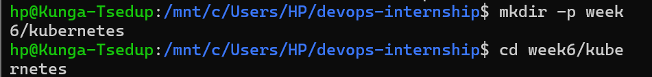
*Figure 57 — creating the week 6 directory*

We started our Minikube cluster using `minikube start`:

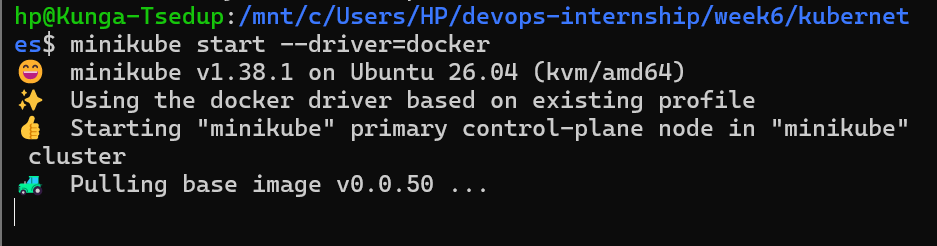
*Figure 58 — minikube start*

We verified the cluster was running by checking nodes using `kubectl get nodes`:

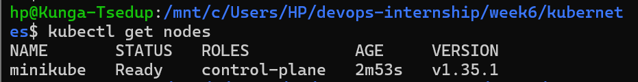
*Figure 59 — checking nodes*

We created a deployment YAML file. A deployment defines what container to run, how many replicas, and how to manage them:

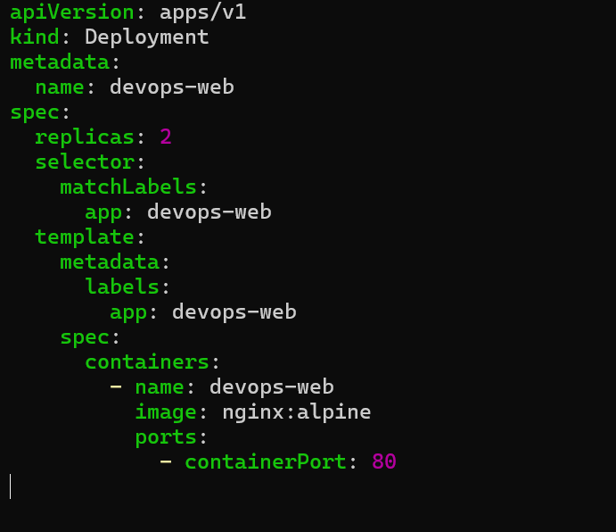
*Figure 60 — deployment YAML*

We also created a service YAML file. A service exposes our deployment so it can be accessed internally or externally:

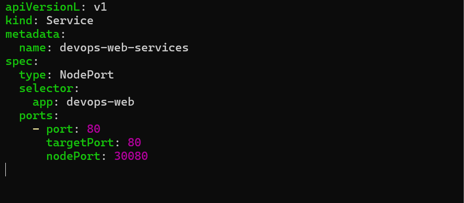
*Figure 61 — service YAML*

We applied both files to the cluster:

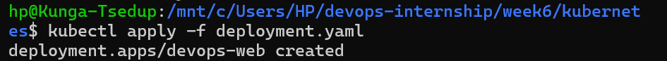
*Figure 62 — applying the deployment*

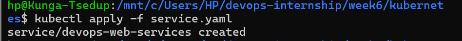
*Figure 63 — applying the service*

We checked our pods using `kubectl get pods`. Pods are the smallest unit in Kubernetes — each pod runs one or more containers:

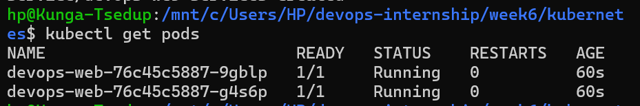
*Figure 64 — pods running*

We checked deployments and services to confirm everything was healthy:

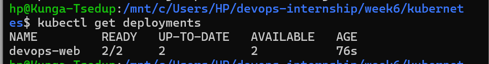
*Figure 65 — deployment status*

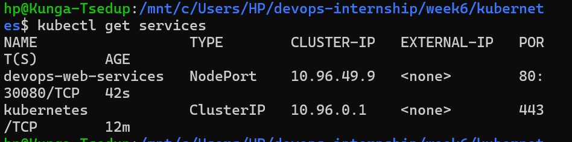
*Figure 66 — services status*

We pulled logs from the deployment using `kubectl logs`:

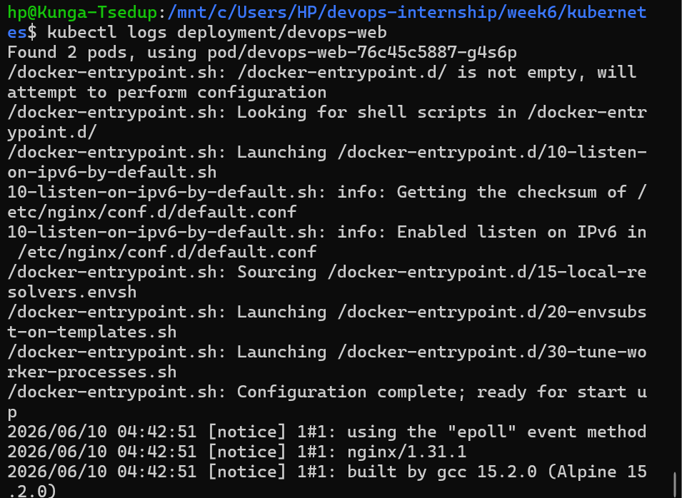
*Figure 67 — deployment logs*

We scaled the deployment to more replicas using `kubectl scale`:

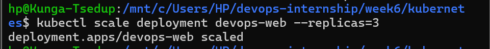
*Figure 68 — scaling the deployment*

We practiced scaling up and down to understand how Kubernetes adjusts pods dynamically:

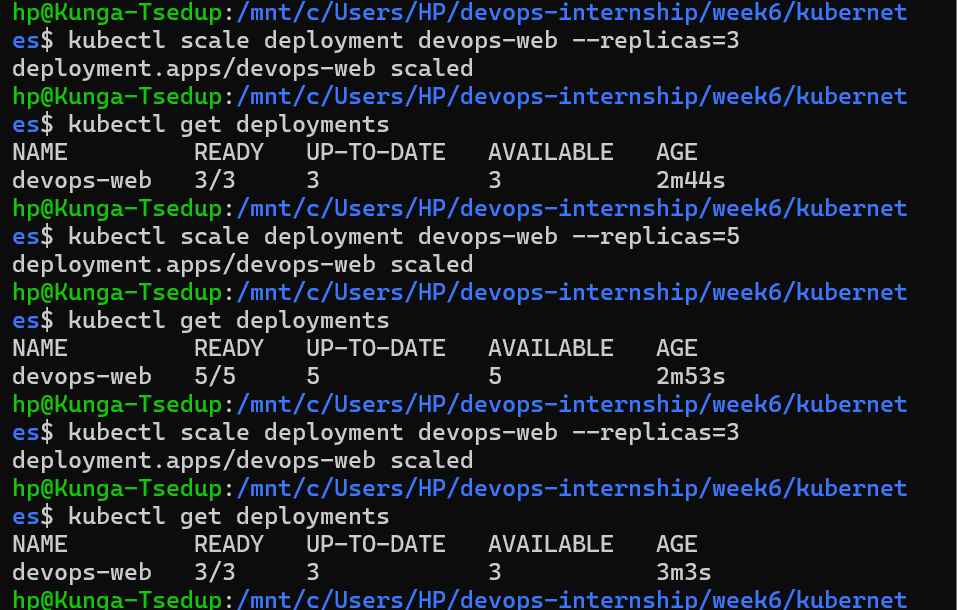
*Figure 69 — scaling up and down*

We verified the pod count had updated correctly:

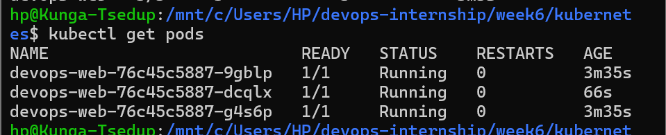
*Figure 70 — updated pod count*

We accessed the application through Minikube using `minikube service` which generates a local URL:

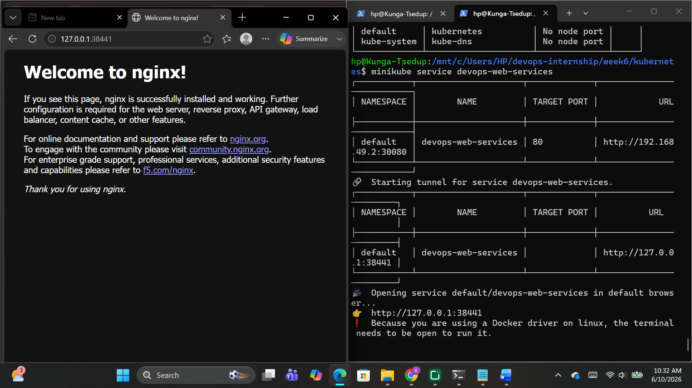
*Figure 71 — accessing the app via Minikube*

We then cleaned up by deleting the service and deployment:

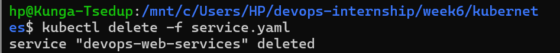
*Figure 72 — deleting the service*

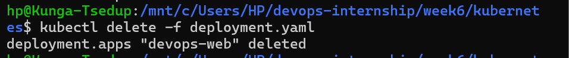
*Figure 73 — deleting the deployment*

> **Conclusion:** This week gave us a solid foundation in Kubernetes. We went from starting a local cluster all the way to deploying, scaling, accessing and cleaning up an application — all through YAML files and kubectl commands. It showed us how Kubernetes brings structure and reliability to container management that goes far beyond what Docker alone can offer.

---

## Week 7 — Prometheus, Grafana & Vault

> **Task:** Run Prometheus, Grafana, and Vault locally. Create a Grafana dashboard, connect Prometheus as a data source, explore metrics, and store/retrieve a secret from Vault.

This week we explored two major concepts in DevOps: **observability** and **secrets management**. Observability is about being able to see what is happening inside our running systems through metrics and logs. Secrets management is about securely storing sensitive information like passwords and API keys instead of hardcoding them.

### Prometheus & Grafana

We started by writing a Docker Compose file to run both Prometheus and Grafana together:

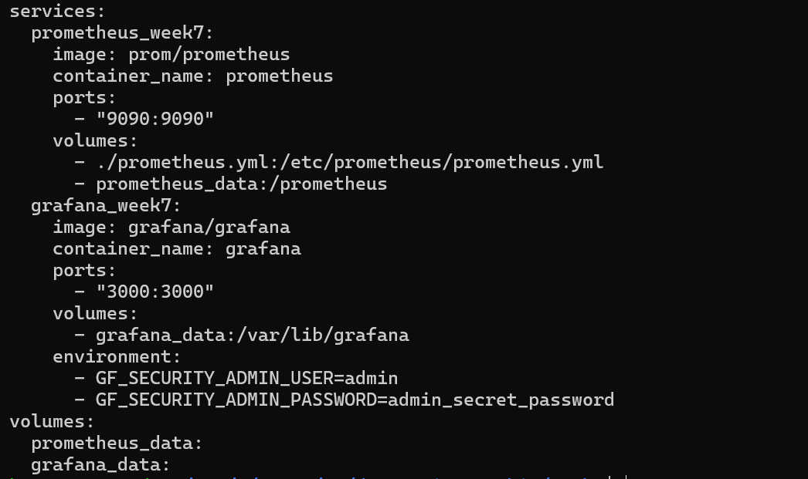
*Figure 74 — Prometheus and Grafana compose file*

We ran the compose file to start both services:

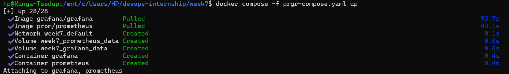
*Figure 75 — running the compose file*

We verified both containers were up using `docker ps`:

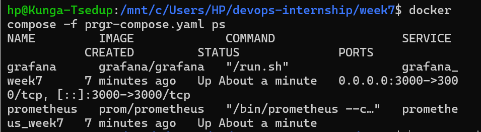
*Figure 76 — containers running*

We checked Prometheus logs to confirm it was scraping correctly:

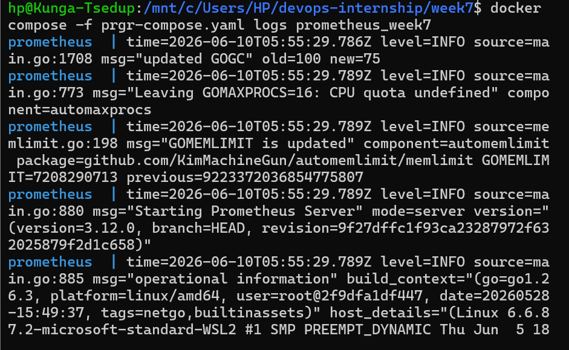
*Figure 77 — Prometheus logs*

We checked Grafana logs to confirm it started without errors:

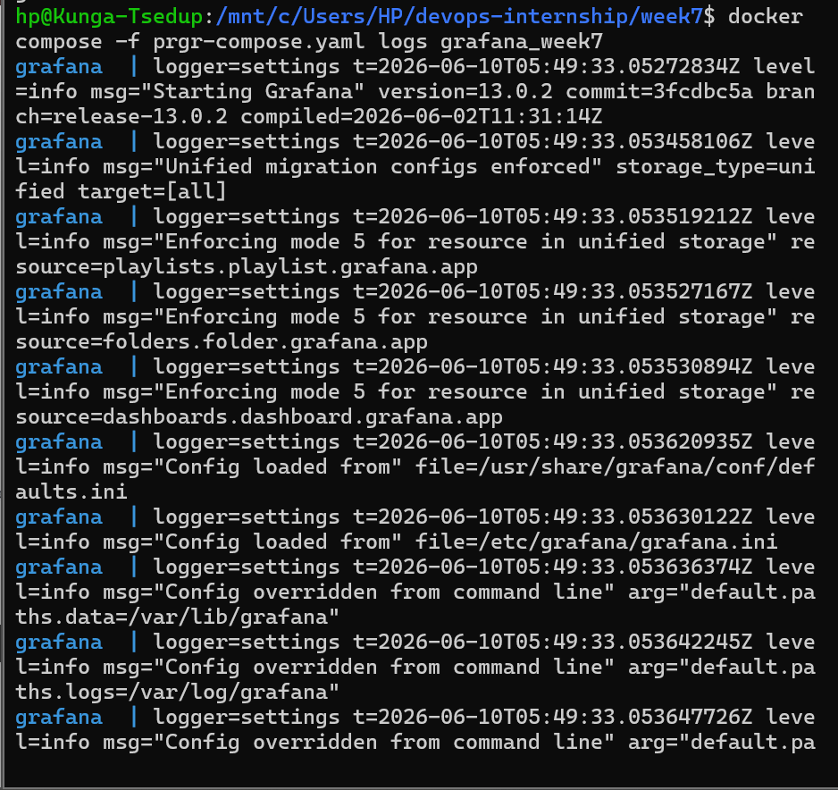
*Figure 78 — Grafana logs*

We opened Grafana in the browser and logged in using the credentials we set via environment variables in our compose file:

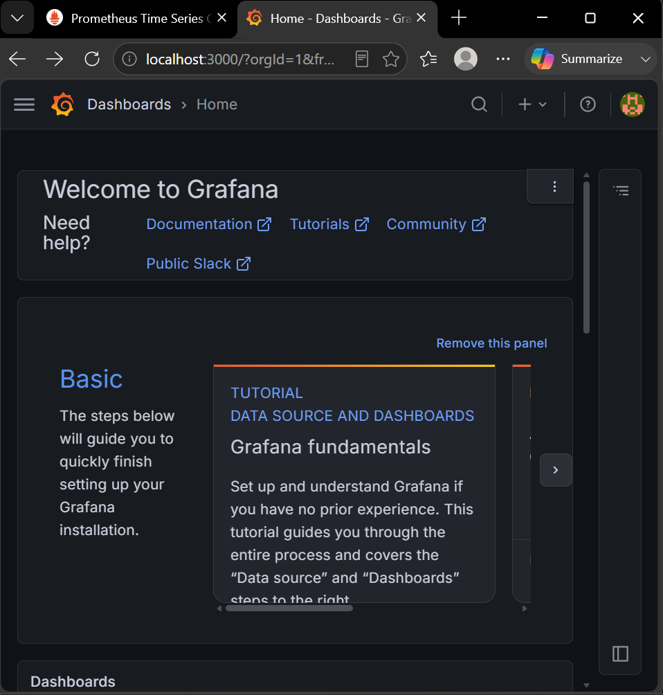
*Figure 79 — Grafana login page*

We connected Prometheus as a data source under Connections, pointing it to the Prometheus container:

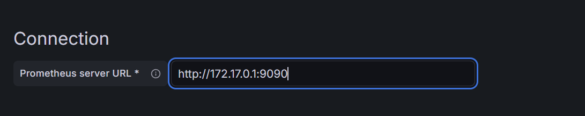
*Figure 80 — adding Prometheus data source*

Grafana confirmed the connection was successful with a green status indicator:

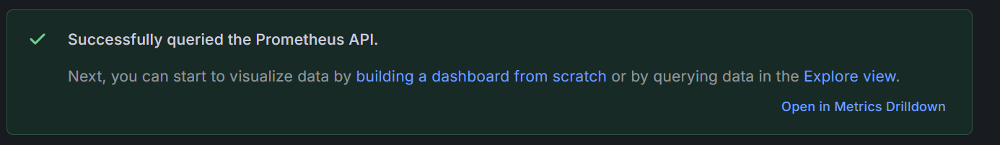
*Figure 81 — successful connection*

We created a dashboard panel and ran the `up` query. The `up` metric returns `1` for every target being scraped successfully:

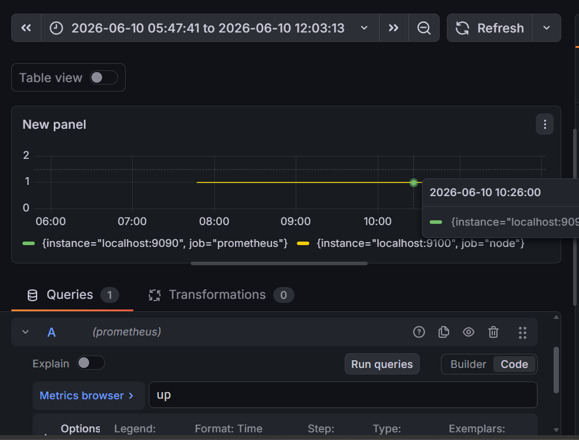
*Figure 82 — dashboard panel with up query*

### HashiCorp Vault

We created a Vault container. Vault is a tool by HashiCorp that securely stores, manages and controls access to secrets:

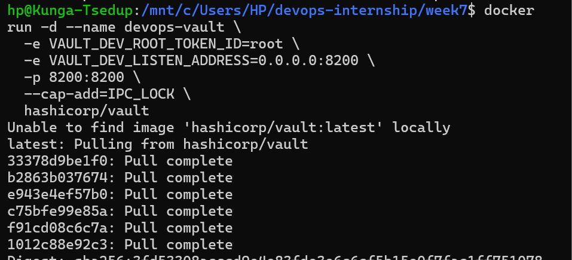
*Figure 83 — initialising Vault*

We started Vault in development mode which provided a root token for access:

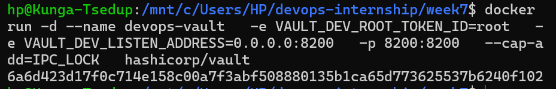
*Figure 84 — running Vault*

We used `vault kv get` to check what was already stored in the secrets path:

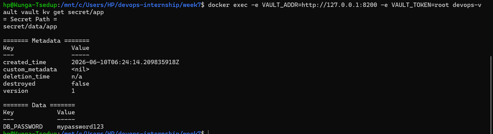
*Figure 85 — vault kv get*

We stored our own secret using `vault kv put`, simulating how a real application would store database credentials securely:

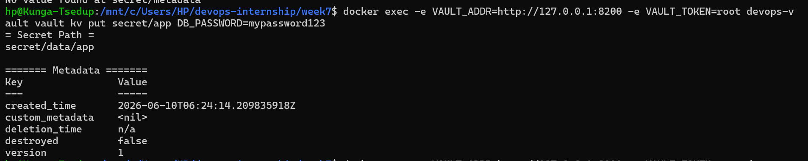
*Figure 86 — vault kv put*

> **Conclusion:** This week connected a lot of important dots. Prometheus and Grafana showed us how to monitor what our systems are doing in real time, while Vault showed us how to handle sensitive information properly. These are not optional extras in production environments — they are standard practice in any serious DevOps setup.

---

## Week 8 — Final Integration

> **Task:** Complete one final integrated DevOps submission demonstrating the ability to take an application from code to container, run CI checks, deploy to AWS EC2, connect data services, add monitoring, and manage secrets safely.

This week served as the final integration week where we brought together everything covered across the internship into one coherent submission. Rather than learning something new, the focus was on demonstrating that all the tools and concepts from previous weeks work together as a complete pipeline.

---

### Architecture Overview

The project follows a standard modern DevOps pipeline. The Flask application sits at the center, containerised using Docker and served behind a Docker Compose setup. All source code lives in a GitHub repository with an organised folder structure separating application code, infrastructure files, and documentation. A GitHub Actions CI pipeline runs automatically on every push to validate the codebase before anything reaches deployment.

The application is deployed to an AWS EC2 instance running Ubuntu. The EC2 instance pulls the repository, builds the containers using Docker Compose, and serves the application on a public IP through a configured security group. However, we do not have present access to these since the actions were performed in a sandbox environment.

Data is handled by PostgreSQL for structured relational storage and MongoDB for flexible document storage, both running as services within the compose setup. Observability is handled by Prometheus and Grafana. Sensitive credentials are stored and retrieved securely using HashiCorp Vault rather than being hardcoded or left in plain text environment files.

---

### Pipeline Summary

| Week | Focus | Key Outcome |
|---|---|---|
| Week 1 | Linux Workspace | Shell scripts, file permissions, log inspection |
| Week 2 | Git & CI/CD | GitHub Actions pipeline, branching, pull requests |
| Week 3 | Docker | Dockerfile, Docker Compose, containerised Flask app |
| Week 4 | Databases | PostgreSQL and MongoDB CRUD, persistent volumes |
| Week 5 | AWS | EC2 deployment, S3 file storage, SSH access |
| Week 6 | Kubernetes | Minikube, YAML manifests, scaling, self-healing |
| Week 7 | Observability | Prometheus, Grafana dashboard, Vault secrets |
| Week 8 | Integration | Full pipeline end to end |

---

### Setup Steps

```bash
# 1. Clone the repository
git clone https://github.com/YOUR_USERNAME/devops-internship.git
cd devops-internship

# 2. Copy environment variables
cp .env.example .env
# Edit .env and fill in the required values

# 3. Start all services
cd infra/docker
docker compose up -d

# 4. Access the application
# App:        http://localhost:8080
# Grafana:    http://localhost:3000
# Prometheus: http://localhost:9090

# 5. Start Vault and export credentials
export VAULT_ADDR=http://127.0.0.1:8200
export VAULT_TOKEN=root
```

---

### Key Commands Reference

```bash
# ── Docker ──────────────────────────────────────────────
docker compose up -d              # Start the full stack
docker compose down               # Stop the full stack
docker ps                         # Check running containers
docker logs container_name        # View logs for a service

# ── Git ─────────────────────────────────────────────────
git add .
git commit -m "message"
git push origin main

# ── AWS ─────────────────────────────────────────────────
ssh -i keyname.pem ubuntu@EC2_PUBLIC_IP    # SSH into EC2
aws s3 cp file.txt s3://bucket-name/       # Upload to S3
aws s3 ls s3://bucket-name/               # List S3 bucket

# ── Kubernetes ──────────────────────────────────────────
kubectl apply -f deployment.yaml           # Apply manifest
kubectl apply -f service.yaml
kubectl get pods                           # List pods
kubectl scale deployment app --replicas=3  # Scale deployment
kubectl logs pod-name                      # View pod logs

# ── Vault ───────────────────────────────────────────────
docker exec -e VAULT_ADDR=http://127.0.0.1:8200 \
  -e VAULT_TOKEN=root devops-vault \
  vault kv put secret/app KEY=value        # Store secret

docker exec -e VAULT_ADDR=http://127.0.0.1:8200 \
  -e VAULT_TOKEN=root devops-vault \
  vault kv get secret/app                  # Retrieve secret
```

---

### Troubleshooting

| Problem | Fix |
|---|---|
| SSH permission denied on `.pem` file | Move the file into Git Bash home directory and run `chmod 600 keyname.pem` |
| Docker container cannot reach database | Use the service name (e.g. `postgres`) as the host, not `localhost` |
| GitHub push rejected due to large file | Run `git rm --cached filename` and add it to `.gitignore` |
| Port already in use when starting containers | Run `docker ps` to find the conflicting container and stop it |
| Grafana showing no data from Prometheus | Use `http://prometheus:9090` as the URL — both containers must be on the same Compose network |

---

### Learning Reflection

Coming into this internship the tools felt abstract and disconnected. By the end they form a clear picture of how modern software actually gets built, deployed and maintained. The biggest shift was understanding that DevOps is not just about individual tools but about the pipeline as a whole — each week built directly on the last and the value only became clear once everything was connected.

The most challenging part was working with AWS and understanding networking — security groups, SSH keys, and why `localhost` behaves differently inside containers than on a local machine. These were not things that could be understood just by reading. They had to be broken and fixed before they made sense.

If we were to do it again we would set up the folder structure and `.gitignore` more carefully from day one to avoid issues like accidentally committing large files or sensitive credentials. Documentation also felt like an afterthought early on but became increasingly important as the project grew.

Overall this internship covered a realistic slice of what a junior DevOps role looks like in practice and left us with a working project we can actually speak to in detail.

Moving on, with the extra time we have, we will be diving deeper into AWS, exploring IaC tools like Terraform and Ansible, and furthering our understanding of Kubernetes and Helm.

---

<div align="center">

*DevOps Internship — 8 Weeks · Linux · Git · Docker · AWS · Kubernetes · Prometheus · Vault*

</div>
