Dev-Ops Internship

Week 1:

Interns must create a Linux practice workspace, write shell scripts for system information and backup simulation, inspect logs, use grep to search text, and practice file permissions. The practical work should train them to use terminal confidently before cloud and Docker work starts.

- In this task, we created a Linux practice workshape for our devops-intern. We created a file system with devops-internship/ week1/ {script, logs, backup and notes}. Then we added some intro text into the notes by creating a new .txt file within it. Similarly we also created a .sh file in script that displayed user info, date, current directory and data usage. The screenshot for this scripting is provided below:

Figure 1 system_info.sh script

We then used chmod +x to execute the file ( Although bash could directly be used, we wanted to practice file permissions), and used tee command to store the data directly into logs. Moving on, we were able to use the grep command to search for specific data within the logs such as 'user' or 'data usage'.
Additionally, we also created a new file that allowed us to directly create a backup of the script folder and the notes folder. We did this by creating an executable file that recursively copied the contents of these folders into two separate folders within backup. We tested it and the backup sh code ran perfectly and did not mess with the log since we had not intended for there to be a tee command. The screenshot is provided below:

Figure 2 script for saving

Week 2: 
Interns must push Week 1 Linux scripts to GitHub, create a new branch, update README.md, open a pull request, and set up a simple GitHub Actions workflow that validates the repository by running shell commands.

Pushing Week1 Linux scripts to GitHub:
In this week’s task, we firstly learned how to use git. We learned all the important commands that taught us:
* how to start a git (git init), 
* how to stage changes (git add)
* how to view them (git status)
* how to commit them (git commit)
* how to view commits (git log)

Additionally, we learned how to create and connect to a repository in github to take our work from local to remote. We did this by first logging into gh through the terminal and linking our project to the repository. We used the command: git remote add name <link>. We used SSH keys instead of personal tokens to prevent the hassle of having to login again and again.

After linking our week1 devops-internship directory to github, we pushed all of the codes into the repository using git push -u origin main. In practice, it is always advised to pull before pushing to prevent  unwanted errors but we ignored this since our repository was empty. Given below is the screenshot of our pushed repository:

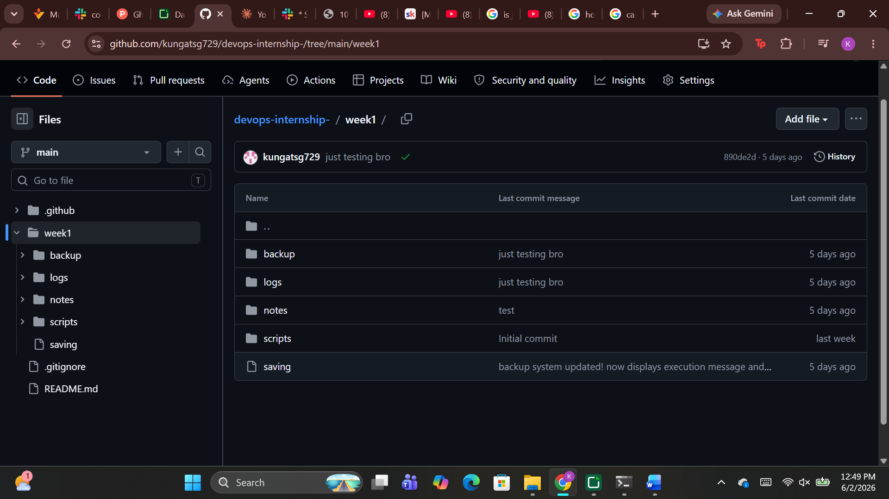

Figure 3 repository pushed into gh

In figure 3, we can alsp see a .gitignore file stored. A .gitignore file is an invisible file that contains files that you do NOT want to push to github. This includes sensitive files like ssh keys, passwords, secrets, etc.

Creating a new branch (week2-git-cicd):
For the next task we created a branch in our repository. We were originally in the ‘main’ branch but we created a separate branch called ‘week2-git-cicd’. Branches are an important part of git since they help us to debug, test out new features, etc in a safe environment without harming the original file. 
We created a branch using git branch week2-git-cicd command and used git checkout week2-git-cicd to move into that branch. We can see the branches made using the git branch command like shown below:

Figure 4 git branches
After creating the branch and some changes into it, we checked to see the main branch but the file in the main branch stayed exactly the same. Then we committed the changes and tried to push it to gh. 
After successfully pushing, we tried to create a pull request too. We changed the readme from gh itself and tried to pull from our terminal. That too was successful.
Then we merged the branches in main using git merge <target> <destination>.  After committing and pushing these changes, we saw that it was updated in the remote repository as well.
The creation of CI/CD using yaml:
CI/CD is a core aspect of devops and cloud engineering. A CI/CD pipeline is basically a repeatable sequence of steps that organizes task, info and decisions to accomplish a specific task. 
To create one for our project, we first created a CI/CD file under .github/workflows. This is vital while creating any CI/CD file. We created this file using YAML which a data serialization language. The exact file we created is shown below:

Figure 5 CI
This file created a condition testing code validity that ran when one of our branches pushed or our main branch pulled. We tested to see if this was working by pushing a branch with intentional errors of our repository and this was the result:

Figure 6 error in code CI

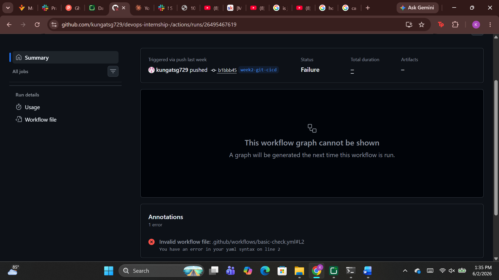

Figure 7 error details
We found out that GitHub actions logged the user who made the push and rejected it due to an error that we placed on our yaml syntax on line 2. We also got an email regarding the reject informing us to make changes and re-push. This showcases the obvious benefits of a CI pipeline with clear accountability, error description and error notification making the developer’s job easier.
We fixed the error and tried pushing it again resulting in following:

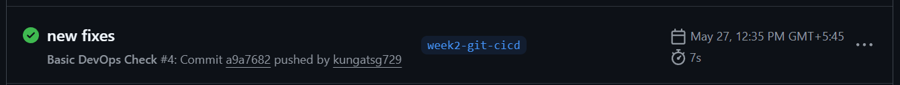

Figure 8 fixed push

Figure 9 fixed push info
We can see that the repository was pushed successfully after fixing the error. One thing to note is that github actions does not emphasize on notifying when a push is successful since sending a mail everytime regardless of error makes it more prone to being ignored.
In conclusion, we learned how to confidently operate using git and github while also learning how to build a basic yml file and diving into the fundamentals of CI/CD. We will use this knowledge throughout our internship program and in our future endeavors even in fields that may not be totally cloud related.

Week 3: 
Interns must create a simple containerized application, build an image, run it as a container, check logs, stop/remove containers, and then use Docker Compose to manage services together. The main learning is understanding what happens during build and run.

In this week, we learned how to create a simple containerized application using docker and how to run it along with container creation, writing yaml files for Dockerfile and docker compose. 

The first thing we did is created a simple python application using flask to run it on localhost. The screenshot of the code is provided below:

We then created a Dockerfile to containerize and run the application by building a docker image. 
We installed python3 and python3pip for flask within the file and created a command to be executed during container creation. We also copied our python file as the source into /app.

We then built the image and ran the container using the following commands:
image building:

Running container:

Furthermore, we checked what containers are running using docker ps command and used docker logs to view its status. Similarly, we stopped and removed the container using docker stop and docker rm respectively.
Container status:

Container log:

Container stop:

Container remove:
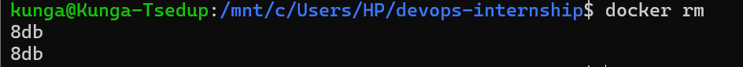

Moving on to the next part of the assignment, we created a docker-compose.yml file. We used the same solo local Dockerfile to build it for simplicity although it could’ve been done using multiple containers.
The docker-compose file is shown below:

Similarly, we used docker compose up to run this file and checked the status of the containers.

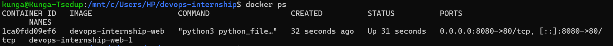
To end this week’s assignment, we shut the container down by using the docker compose down command as shown below:

Conclusion: 
In this week, we thoroughly learned how to use docker, its purposes, importance, syntax of a dockerfile and dockercompose file, the concept of volumes, port-mapping etc. We will be using the knowledge obtained from this week throughout coming weeks.

Week4:
Interns must run PostgreSQL and MongoDB in containers, perform basic CRUD operations, create persistent volumes, inspect logs, and write connection details as environment variables. They should understand SQL vs NoSQL from operational and application perspectives.

In this week, we combined what we had learned earlier weeks to run a persistent volume database fully inside a container. We did this by creating a docker-compose file as shown below:

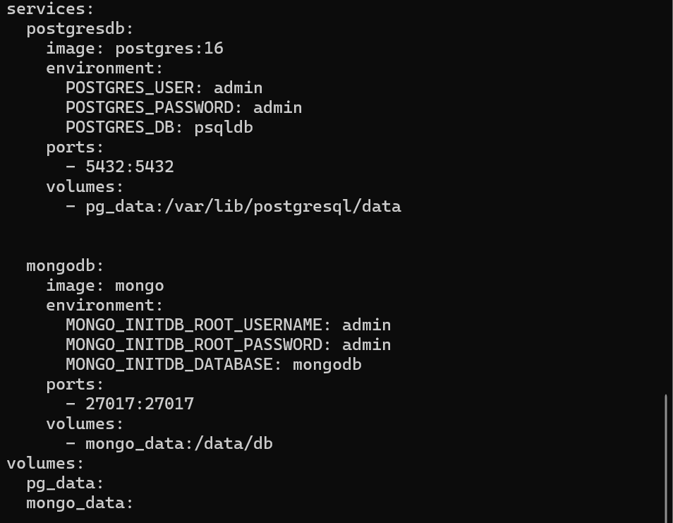

We selected the appropriate image, set the environment variables, exposed their respective ports and mapped the volume to physical local storage for persistence. Mapping the volume is important especially in containerized databases since killing the container kills the data permanently too without it. 
We ran the compose file next using the following command:
(note: we used -f (flag) because we already have a docker-compose file and we don’t want them to clash)

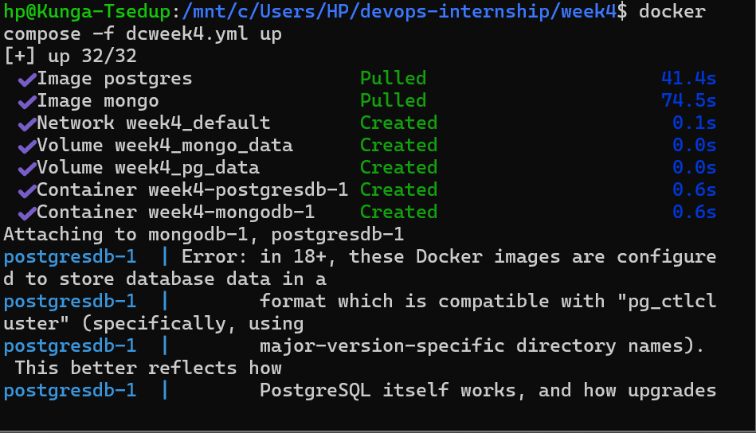

After successfully running the containers, we checked the running status, container names and everything using docker ps. Then we went into both postgres and mongodb terminals to perform basic CRUD operations to test and further understand databases in containers.
We noticed that the commands were slightly different in terminals but it was not as difficult as it looked once you got the hang of it.
We first performed the operations on postgresql with the screenshots of commands provided below:

Psql:
Create (Table):
  
Insert:
  
  
  

Update:
  
  
Delete:
  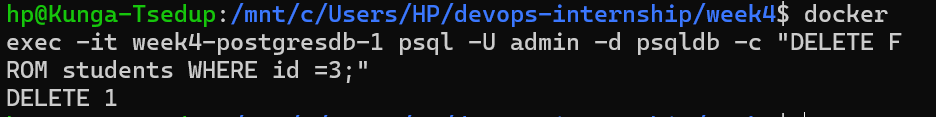
  

Mongodb:
Create:
  Db:
  
  Table:
  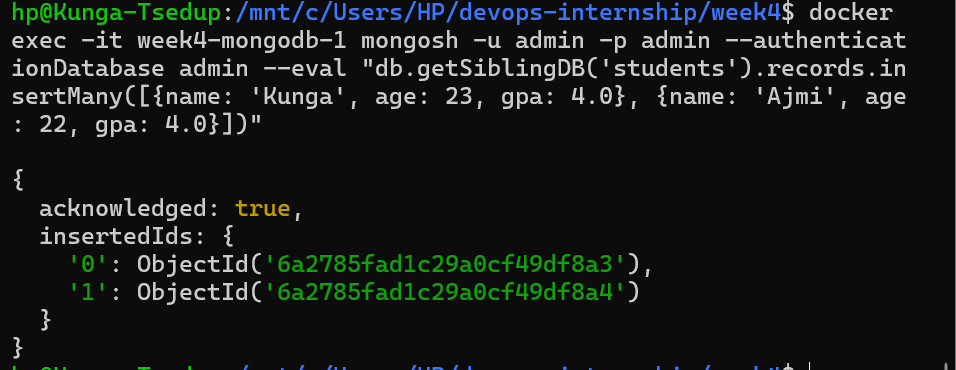
  
Update:
  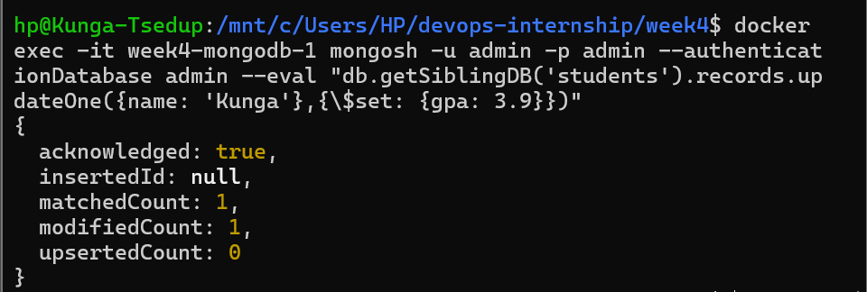
  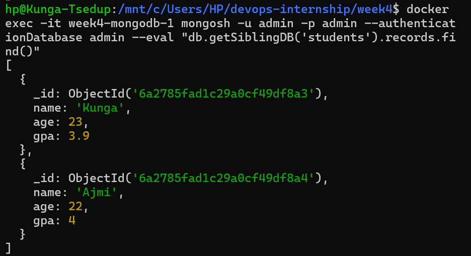
Delete:
  
  

After checking all these operations, we can safely say that we have thoroughly learned databases, containerization and databases in containers. We further checked our logs to exercise our understanding regarding the subject. We saw that our records were stored along the many lines of the given image:

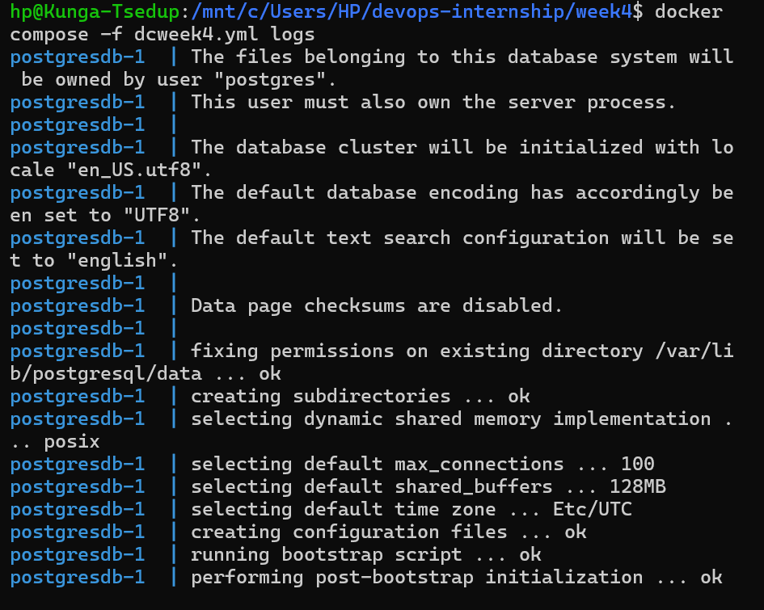

Differences between SQl and NoSQL:
Basically SQL databases like PostgreSQL store data in tables with rows and columns, kind of like a spreadsheet. Everything has a strict structure and you have to define what columns exist before you can put data in. Its good when your data is predictable and you need relationships between tables like connecting a user to their orders.
NoSQL databases like MongoDB are more flexible. Instead of tables you have collections and instead of rows you have documents which are basically JSON objects. You dont have to define a structure beforehand so if your data changes shape a lot it works better. The downside is theres no strict rules so you can accidentally store inconsistent data.
For this week I ran both using Docker Compose and practiced basic CRUD operations on both. Honestly PostgreSQL felt more familiar because SQL syntax is straightforward. MongoDB took a bit to get used to especially the query syntax.

Why volumes are needed:
When I first ran the database container without a volume I realized that every time I stopped and removed the container all my data was gone. Thats because containers dont store data permanently by default, everything inside them is temporary.
Volumes fix this by storing the actual database files outside the container on the host machine. So even if the container crashes or gets deleted the data is still there. When you start a new container and attach the same volume it picks up right where it left off.
Without volumes, databases in Docker are useless for anything real because we would lose everything on every restart.

Conclusion:
This week we got PostgreSQL and MongoDB running together using Docker Compose. Getting the environment variable names right took some trial and error but once that was sorted both databases came up without issues.
The biggest thing that clicked was volumes. We actually lost data after stopping a container which made it immediately obvious why volumes exist. Without them there is no point running a database in Docker.
Comparing SQL and NoSQL hands on was more useful than just reading about it. PostgreSQL felt structured and predictable, MongoDB was flexible but less strict. Both have their place depending on what the data looks like.
One thing that caught us off guard was Docker Compose prefixing container names with the folder name. Once we knew that running commands against the right container became straightforward.

Week 5:
Interns must deploy a Dockerized app to EC2. They should connect through SSH, install Docker, run the container, expose the correct port, check logs, and access the app from browser using EC2 public IP. They also upload a sample file to S3 and explain how storage is separate from compute.

This week we will be learning about some cloud technologies and services from AWS, AWS EC2 and S3. 
Amazon EC2 (Elastic Compute Cloud) is essentially a rentable computer in the cloud. Instead of buying a physical server, we spin one up on AWS in minutes, choose the operating system, size, and region, and pay only for what we use. You connect to it remotely via SSH just like we would a real machine and can run anything on it including web servers, databases, Docker containers. When we don't need it we stop it and stop paying.
Amazon S3 (Simple Storage Service) is cloud storage for files. Not a computer you log into, just a place to put files, images, backups, logs, videos, anything. You organize files into buckets and access them from anywhere via the AWS CLI, SDK, or a URL. It's virtually unlimited in size, highly reliable, and very cheap. Think of it like Google Drive but for applications rather than people.
Together they cover two fundamental cloud needs: compute (EC2 does the running and processing) and storage (S3 holds the data). Almost every real-world AWS deployment uses both, which is exactly why Week 5 introduced them together.

The first thing we need in this week's project is create an EC2 instance. We logged into our AWS account, went to EC2, then create instance. We specified our name, our required os, the required hardware, generated a new key pair and set up security configurations. Given below is a screenshot of the created instance.

We then went to our key-pair location and opened a git bash terminal there. We also changed the permission for the key into 400 i.e, user(us) gets to read and write while others get 0 permissions.

After changing the permissions, we started the ec2 using our terminal as shown below with the following code:

The newly created ec2 machine does not come with pre-installed tools that we require. So in order to bridge that gap we installed all the required tools such as docker and git. We also logged into our gh account and added a ssh key.

After these tools were installed, we needed to launch our week 3 dockerfile that contained a pyflask application with code to display a simple web app with "Hello Docker" printed.

In order to achieve this, we first cloned the repository into our virtual machine as shown below:

Then we ran the container. We simply ran the compose file since it would basically result in the same thing.

We then checked if the container was up and running using the docker ps command.

We had to now check if the application was also being loaded into our web servers. Normally in our computer we would just go to localhost:8080 but that is not possible in EC2. We first tried running the localhost:8080 into our web app showcasing an error, we tried again using the instance's public ip but it still showed an error. So, we checked if the problem was within our application/ instance or on our local machine. We used the curl command within our ec2 to check if the site was reachable and indeed it was.

So, the problem was within our local machine. We found out that amazon public ips do NOT work on https and MUST be on http. Our website was automatically directing us to https so we changed it and ran again.

Our run was successful now.

Similar to this we can run various containers and do unlimited number of things in EC2. We also have figuratively unlimited computing power and availability/ reliability but we must still store our files somewhere more persistent incase our machine crashes. This is where s3 comes in.
To use s3 we first connected our virtual machine to our dashboard using aws configure.
We specified our keys from IAM, selected the appropriate region and specified the output format we desire.

After the connection was successful, we proceeded to make an s3 bucket.

Buckets are where the data is stored in S3. We used the terminal to create these buckets instead of directly creating in the dashboard since creating in the terminal is a bit more complex and good for learning. We first created a file on our folder and then copied it into s3 as shown below:

Then we checked the creation using ls command within our aws cli.

We had to verify that the bucket and the file was created. So we went into the dashboard and checked to see our bucket named kunga-devops-week5.

We found the bucket.

Then we went further and checked for the file we created inside the bucket. The file was also present showcasing our successful data entry using aws cli.

For further practice, we moved the ss folder into the s3 directly by using mv command recursively. Snippets of the commands and functions are given below:

Conclusion:
This week gave us our first real taste of cloud deployment. Moving from a local machine to an actual server on AWS, accessing it remotely and seeing our app live on a public IP was a significant step up from previous weeks. S3 also showed us how storage and compute are handled separately in the cloud which is a fundamental concept in modern infrastructure. Overall a productive week that tied together a lot of what we had been building up to.

Week 6:
Iterns must deploy their Docker app to local Kubernetes. They should create YAML manifests, apply them, inspect pods, check logs, expose the service, scale replicas, delete pods, and observe Kubernetes recreating them

This week we explored Kubernetes, a container orchestration tool that automates the deployment, scaling and management of containerized applications. Instead of running containers manually with Docker, Kubernetes manages them for us in a structured and reliable way. We used Minikube, a lightweight tool that lets us run a Kubernetes cluster locally on our machine for learning and testing purposes.

The first thing we did was create a dedicated directory for this week's work and set up our files.

We then started our Minikube cluster using the minikube start command. This spun up a local single-node Kubernetes cluster on our machine.

After starting the cluster, we verified it was running correctly by checking the nodes using kubectl get nodes. A node is essentially the machine that runs our containers inside Kubernetes.

With the cluster running, we created a deployment YAML file. A deployment in Kubernetes defines what container to run, how many copies of it to run, and how to manage it. This is the core of how Kubernetes handles our application.

We also created a service YAML file. A service exposes our deployment so it can be accessed either internally or externally. Without a service, our pods would be running but unreachable.

After writing both files, we applied the deployment to our cluster using kubectl apply.

We then applied the service file in the same way.

To confirm everything was running, we checked our pods using kubectl get pods. Pods are the smallest unit in Kubernetes — each pod runs one or more containers.

We also ran kubectl get deployments to confirm the deployment was healthy and had the correct number of replicas running.

Then we checked our services to confirm the service was active and had the correct port mappings.

To debug and monitor our application, we pulled the logs from the deployment directly using kubectl logs. This is the Kubernetes equivalent of docker logs and is essential for troubleshooting.

One of the key features of Kubernetes is scaling. We scaled our deployment to run more replicas using the kubectl scale command. This simulates how real applications handle increased traffic by running multiple instances.

We then practiced scaling up and down to understand how Kubernetes adjusts the number of running pods dynamically.

After scaling, we verified the pod count had updated correctly using kubectl get pods again.

We then accessed the application through Minikube to confirm it was reachable in the browser using the minikube service command which generates a local URL for us.

Once we had verified everything was working, we practiced cleaning up resources. We first deleted the service.

Then we deleted the deployment, fully removing the application from our cluster.

Conclusion:
This week gave us a solid foundation in Kubernetes. We went from starting a local cluster all the way to deploying, scaling, accessing and cleaning up an application — all through YAML files and kubectl commands. It showed us how Kubernetes brings structure and reliability to container management that goes far beyond what Docker alone can offer.

Week 7:
Interns must run Prometheus, Grafana, and Vault locally. They should create a Grafana dashboard, connect Prometheus as a data source, explore metrics, and store/retrieve a secret from Vault. The focus is understanding observability and secure secret handling.

This week we explored two major concepts in DevOps: observability and secrets management. Observability is about being able to see what is happening inside our running systems through metrics and logs. Secrets management is about securely storing sensitive information like passwords and API keys instead of hardcoding them. We used Prometheus and Grafana for observability and HashiCorp Vault for secrets management.

We started by writing a Docker Compose file that would run both Prometheus and Grafana together as containers.

We then ran the compose file to start both services.

After running the containers, we verified both were up and healthy using docker ps.

To confirm Prometheus was working, we checked its logs directly. Prometheus is the tool that scrapes and stores metrics from our services over time.

We also checked the Grafana logs to confirm it had started up without any errors. Grafana is the visualization layer that sits on top of Prometheus and lets us build dashboards from the collected metrics.

With both services confirmed running, we opened Grafana in the browser and logged in. We had set the credentials using environment variables in our compose file so no manual setup was needed.

The next step was connecting Prometheus as a data source inside Grafana. Without this link, Grafana has no data to visualize. We went to Connections, added Prometheus as a data source and pointed it to the Prometheus container.

After saving the configuration, Grafana confirmed the connection was successful with a green status indicator.

With the data source connected, we created a new dashboard panel and ran the up query. The up metric in Prometheus returns a 1 for every target that is currently being scraped successfully, confirming our setup was working end to end.

Moving on to secrets management, we created a Vault container. Vault is a tool by HashiCorp that securely stores, manages and controls access to secrets. Instead of putting passwords in .env files or hardcoding them in code, we store them in Vault and retrieve them at runtime.

We then started the Vault container in development mode which gave us a root token for access.

With Vault running, we used the vault kv get command to check what was already stored in the secrets path.

We then stored our own secret using vault kv put, simulating how a real application would store database credentials or API keys securely in Vault rather than in plain text files.

Conclusion:
This week connected a lot of important dots. Prometheus and Grafana showed us how to monitor what our systems are doing in real time, while Vault showed us how to handle sensitive information properly. These are not optional extras in production environments, they are standard practice in any serious DevOps setup. Overall a challenging but very rewarding week.

Week 8:
Interns must complete one final integrated DevOps submission. The final project should show that they can take an application from code to container, run checks through GitHub Actions, deploy to AWS EC2, connect data services where needed, add monitoring, and manage secrets safely.

This week served as the final integration week where we brought together everything covered across the internship into one coherent submission. Rather than learning something new, the focus was on demonstrating that all the tools and concepts from previous weeks work together as a complete pipeline.

Architecture Overview:

The project follows a standard modern DevOps pipeline. The Flask application sits at the center, containerized using Docker and served behind a docker-compose setup. All source code lives in a GitHub repository with an organised folder structure separating application code, infrastructure files, and documentation. A GitHub Actions CI pipeline runs automatically on every push to validate the codebase before anything reaches deployment.

The application is deployed to an AWS EC2 instance running Ubuntu. The EC2 instance should pull the repository, builds the containers using Docker Compose, and serves the application on a public IP through a configured security group. However, we do not have present access to theses since the actions were performed in a sandbox environment. 

Data must be handled by PostgreSQL for structured relational storage and MongoDB for flexible document storage, both running as services within the compose setup.

Observability is handled by Prometheus which scrapes metrics from the running services, and Grafana which visualizes those metrics through a connected dashboard. Sensitive credentials such as database passwords are stored and retrieved securely using HashiCorp Vault rather than being hardcoded or left in plain text environment files.

---

Pipeline Summary:

Week 1 — Set up the Linux workspace, wrote shell scripts for system info and backup, practiced file permissions and log inspection.

Week 2 — Pushed the project to GitHub, created branches, opened pull requests, and set up a GitHub Actions CI workflow to validate scripts and files automatically.

Week 3 — Containerized the Flask application using a Dockerfile, wrote a docker-compose.yml to orchestrate multiple services, and tested everything locally.

Week 4 — Added PostgreSQL and MongoDB to the compose setup, implemented full CRUD operations, and verified data persistence across container restarts.

Week 5 — Deployed the full stack to an AWS EC2 instance, configured security groups, accessed the live application from a browser, and uploaded files to S3.

Week 6 — Deployed the application to a local Kubernetes cluster using Minikube, wrote deployment and service YAML files, scaled replicas, and practiced resource cleanup.

Week 7 — Set up Prometheus and Grafana for monitoring, connected them via Docker Compose, built a dashboard, and stored and retrieved secrets securely using Vault.

Setup Steps:

1. Clone the repository from GitHub.
2. Copy .env.example to .env and fill in the required values.
3. From the infra/docker directory run docker compose up -d to start all services.
4. Access the application at localhost on the configured port.
5. Access Grafana at localhost:3000 and Prometheus at localhost:9090.
6. Start the Vault container and export VAULT_ADDR and VAULT_TOKEN before running any vault commands.

Key Commands Reference:

# Start the full stack
docker compose up -d

# Check running containers
docker ps

# View logs for a specific service
docker logs container_name

# Push to GitHub
git add .
git commit -m "message"
git push origin main

# SSH into EC2
ssh -i keyname.pem ubuntu@EC2_PUBLIC_IP

# Store a secret in Vault
docker exec -e VAULT_ADDR=http://127.0.0.1:8200 -e VAULT_TOKEN=root devops-vault vault kv put secret/app KEY=value

# Retrieve a secret from Vault
docker exec -e VAULT_ADDR=http://127.0.0.1:8200 -e VAULT_TOKEN=root devops-vault vault kv get secret/app

# Apply Kubernetes manifests
kubectl apply -f deployment.yaml
kubectl apply -f service.yaml

# Scale a deployment
kubectl scale deployment app-deployment --replicas=3

Troubleshooting:

SSH permission denied on .pem file — The key file permissions were too open. Moving the file from the Windows filesystem into the WSL or Git Bash home directory and running chmod 600 fixed it.

Docker container cannot reach database — Using localhost as the database host inside a container does not work. The correct host is the service name defined in docker-compose.yml such as postgres or mongo.

GitHub push rejected due to large file — A binary file was accidentally committed. Removing it with git rm --cached and adding it to .gitignore resolved it.

Port already in use when starting containers — Another container from a previous session was still occupying the port. Running docker ps and stopping the conflicting container fixed it.

Grafana showing no data after connecting Prometheus — The Prometheus URL must use the container service name not localhost. Using http://prometheus:9090 works when both containers are on the same Docker Compose network.

Learning Reflection:

Coming into this internship the tools felt abstract and disconnected. By the end they form a clear picture of how modern software actually gets built, deployed and maintained. The biggest shift was understanding that DevOps is not just about individual tools but about the pipeline as a whole — each week built directly on the last and the value only became clear once everything was connected.

The most challenging part was working with AWS and understanding networking, security groups, SSH keys, and why localhost behaves differently inside containers than on a local machine. These were not things that could be understood just by reading. They had to be broken and fixed before they made sense.

If we were to do it again we would set up the folder structure and .gitignore more carefully from day one to avoid issues like accidentally committing large files or sensitive credentials. Documentation also felt like an afterthought early on but became increasingly important as the project grew.

Overall this internship covered a realistic slice of what a junior DevOps role looks like in practice and left us with a working project we can actually speak to in detail.

Moving on, with the extra time we have, we will be diving deeper into AWS, exploring IAC tools like terraform, ansible, etc, learnifurther k8s and helm.
